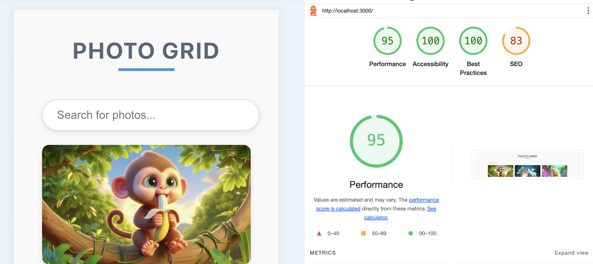

# MASONRY PHOTO GRID

## Overview

The Masonry Photo Grid is a responsive web application that lets users browse and search for photos using the [Pixabay API](https://pixabay.com/api/). It supports infinite scrolling, keyword filtering, and provides a smooth user experience with features like API call debouncing and lazy loading for performance optimization.

## Screenshots

### 1. Masonry Grid Layout


### 2. Photo Details View


### 3. Lighthouse Performance 


### 4. Unit test coverage 


## Features

### 1. Virtualized Masonry Grid Layout
- **Dynamic Layout**: A responsive masonry grid dynamically arranges photos fetched from the Pixabay API.
- **Virtualization**: The grid is virtualized to efficiently handle large sets of images by rendering only the photos visible in the viewport.
- **Custom Layout**: The grid is implemented without any external layout management libraries.
- **Responsive Design**: The layout adapts seamlessly to different screen sizes, ensuring optimal viewing on desktop, tablet, and mobile devices.

### 2. Photo Details View
- **Large Photo Display**: Opens a detailed view with a larger version of the selected photo.
- **Additional Info**: Displays the photo's tags, photographer's name, and the date.
- **Navigation**: A back button is provided to return to the masonry grid.

### 3. Search Functionality (Bonus)
- **Keyword Search**: Users can search for photos by keywords, dynamically updating the grid with results from the API.

### 4. Performance Optimizations
- **Virtualized Rendering**: Images are rendered on demand as the user scrolls, improving performance and reducing memory usage.
- **React Hooks**: Efficient use of `useEffect`, `useMemo`, and `useState` hooks for managing state and optimizing performance.
- **Memoization**: `useMemo` and `useCallback` are used to prevent unnecessary re-renders.

### 5. TypeScript Integration
- **Strong Typing**: The application is fully typed with **TypeScript** to ensure type safety and maintainability.
- **Generic Types**: Utility and generic types are used to improve reusability and type safety across the application.

### 6. React Router
- **Routing**: Utilizes **React Router** to handle navigation between the masonry grid and detailed photo view.

### 7. Styled Components
- **CSS-in-JS**: The app is styled using `styled-components`, providing modular, scoped CSS for easier management and maintenance of styles.

### 8. Error Handling
- **Error Boundaries**: Implemented to catch and handle any runtime errors gracefully, improving user experience.

### 9. Unit testing
#### Test Setup
The app includes **unit tests** to ensure functionality and code correctness. Unit testing is done using **Vitest** and **React Testing Library**.

#### Testing Features
- **Component Testing**: Tests for individual components like the Masonry Grid, Photo Details view, and Search functionality.
- **API Testing**: Tests for verifying the proper interaction with the API.
- **Error Handling**: Tests for verifying that error boundaries work as expected.

## Features Overview
### Infinite Scroll
Scroll down the photo grid to automatically load more photos, enhancing the user experience by progressively rendering new content.

### Photo Search with Debounce
Filter photos using the search bar. The debounce feature ensures that API requests are only sent after the user has stopped typing, improving both performance and user experience.

### Error Handling
If something goes wrong, the app shows a friendly error message with a "Retry" option, ensuring that users can recover from errors easily.


## Technologies Used

- **React**: For building the user interface.
- **Vite**: For fast development and build tooling.
- **TypeScript**: For type safety and better development experience.
- **Axios**: For making HTTP requests.
- **CSS Variables**: For consistent styling and theme management.
- **Vitest**: For unit testing of the components.

## Setup and Installation

### Pixabay API Key
Initially, we intended to use the Unsplash API for fetching images. However, despite creating an account, our app is currently under review, and we were unable to obtain an API key in time. As a result, we switched to using the Pixabay API, which is fully functional and supports all the features we needed for the project. You'll need a Pixabay API key to run the project. A dummy API key is provided for testing purposes.

### Environment Setup
Create a .env file in the root of the project with the following content:
```
VITE_PIXABAY_API_KEY=your_dummy_api_key_here
```
This .env file will store your API key for local development.

### Prerequisites

- Node.js (>= 16.x)
- npm or yarn

### 1. Clone the Repository

```bash
git clone https://github.com/JAIOMP/masonry-photo-grid.git
cd masonry-photo-grid
```

### 2. Install Dependencies
```
npm install
# or
yarn install
```

### 3. Set Up Environment Variables
Make sure to add your Pixabay API key in the .env file as shown above.

## Run the Development Server
```
npm run dev
# or
yarn dev
```

Open your browser and navigate to http://localhost:5173/ to see the app in action.

## Build and Run Instructions
To build the project for production:

### 1. Build the project:

```
npm run build
```
### 2. Serve the build locally:
```
serve -s dist
```

## Acknowledgments
### Pixabay API:
For providing the photo data.

### React Community:
For the extensive documentation and support.
### Vite: 
For a fast and efficient development experience.
